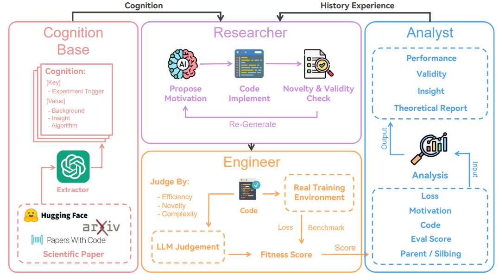

# ASI-GO-3
Artificial SuperIntelligence GO type
# ASI-GO-3: Autonomous System Intelligence - General Optimizer

A simplified implementation of the ASI-ARCH architecture for general problem-solving tasks.

## Overview

ASI-GO-3 adapts the four-component architecture from ASI-ARCH:
- **Cognition Base**: Stores problem-solving strategies and patterns
- **Researcher**: Proposes solutions based on goals
- **Engineer**: Implements and tests solutions
- **Analyst**: Analyzes results and extracts insights


## Setup

1. **Install Dependencies**:
   ```bash
   pip install -r requirements.txt

##  Configure API Keys:

Copy .env.example to .env
Add your API key for your chosen provider:

OpenAI (ChatGPT)
Google (Gemini)
Anthropic (Claude)


##  Select LLM Provider:
Edit .env and set LLM_PROVIDER to one of:

openai (default)
google
anthropic

## Usage
Interactive Mode
bashpython main.py
Command Line Mode
python main.py "Find the first 100 prime numbers"
Features

## Multi-LLM Support: Works with ChatGPT, Gemini, or Claude
Iterative Refinement: Automatically improves solutions based on feedback
Knowledge Persistence: Learns from each problem-solving session

## To use:
1. Install dependencies: `pip install -r requirements.txt`
2. Set up your `.env` file with appropriate API keys
3. Run: `python main.py`

The system will guide you through solving any computational problem you provide!


## Checkpoint System: Saves progress at each step
Comprehensive Logging: Detailed logs for debugging
Windows Optimized: Colored output and Windows-friendly paths

## Example Goals

"Find the first 40 prime numbers"
"Generate the Fibonacci sequence up to 1000"
"Create a function to check if a string is a palindrome"
"Solve the Tower of Hanoi problem with 4 disks"
"Find all perfect numbers less than 10000"

## Architecture
The system follows a cyclic process:

Researcher proposes a solution
Engineer tests the implementation
Analyst evaluates results
Cognition Base stores insights
Loop continues until success or max iterations

## Configuration
Edit .env to customize:

MAX_ITERATIONS: Maximum solving attempts (default: 5)
TEMPERATURE: LLM creativity level (default: 0.7)
LOG_LEVEL: Logging detail (INFO/DEBUG)

## Troubleshooting

API Key Errors: Ensure your API key is correctly set in .env
Import Errors: Run pip install -r requirements.txt
Execution Timeouts: Complex problems may need increased timeout in engineer.py

## LLM Library Compatibility

### OpenAI Library Version Conflicts
When installing ASI-GO, you may encounter a `TypeError: Client.__init__() got an unexpected keyword argument 'proxies'` error. This occurs due to version conflicts between the OpenAI, Anthropic, and httpx libraries. The issue arises because different LLM providers require different versions of the shared httpx dependency. To resolve this, uninstall all LLM-related packages first (`pip uninstall openai anthropic google-generativeai httpx httpcore anyio -y`), then install httpx version 0.24.1 specifically (`pip install httpx==0.24.1`), followed by the OpenAI library (`pip install openai==1.12.0`). If you need multiple LLM providers, install them in this specific order to maintain compatibility. Alternatively, consider using separate conda environments for different LLM providers to avoid conflicts entirely.

## License
MIT License - Feel free to modify and extend!

This implementation provides:

1. **Modular Architecture**: Each component (Cognition Base, Researcher, Engineer, Analyst) is separate and focused
2. **Multi-LLM Support**: Works with ChatGPT, Gemini, or Claude (Grok uses OpenAI's API)
3. **Robust Error Handling**: Comprehensive try-catch blocks and logging
4. **Checkpoint System**: Saves progress at each step
5. **Interactive Interface**: Easy-to-use command line interface with colored output
6. **Knowledge Persistence**: Learns from each session
7. **Windows Optimization**: Uses appropriate paths and libraries for Windows

